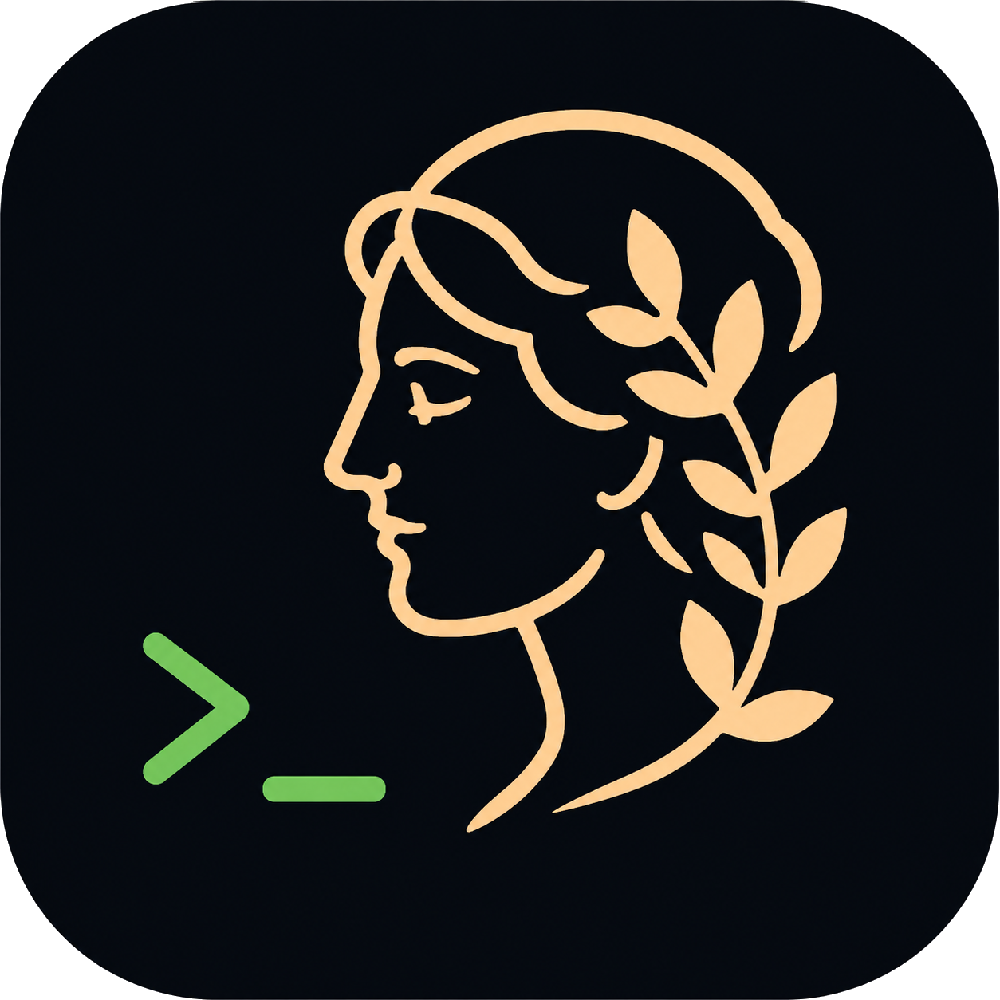

<div align="center">



# 🧠 Metis — AI Desktop & Terminal Assistant

**O ecossistema definitivo de produtividade com Inteligência Artificial para Linux.**  
*Assistente Flutuante (GUI PyQt6) · Visão Multimodal de Tela · Agente Autônomo · Copiloto de Terminal ZSH.*

---

[](https://python.org)
[](https://riverbankcomputing.com/software/pyqt/)
[](https://kernel.org)
[](LICENSE)
[](https://github.com/faelmonteiro/Metis)

</div>

---

## ✨ O que é o Metis?

O **Metis** transforma o seu ambiente Linux em um ecossistema inteligente de alta produtividade. 

Em vez de perder tempo pesquisando erros enigmáticos de compilação, decorando parâmetros complexos ou alternando entre navegadores para pedir ajuda a IAs, o Metis traz o poder dos modelos de linguagem mais avançados do mundo **diretamente para as suas mãos** — seja através de uma interface gráfica flutuante ultrarrápida, de visão de tela em tempo real ou diretamente na linha de comando do seu terminal.

Tudo isso funcionando de forma **híbrida**: totalmente offline/local com **Ollama** (privacidade 100% garantida) ou acelerado por provedores em nuvem de alta velocidade (**Google Gemini 2.0 Flash, Groq, NVIDIA NIM, OpenRouter e G4F**).

---

## 🚀 Principais Módulos e Recursos

### 🎨 1. Interface Gráfica Flutuante (GUI PyQt6)
Um assistente flutuante elegante inspirado nas melhores interfaces do ecossistema Linux:
* **Streaming em Tempo Real:** Respostas fluidas geradas palavra por palavra.
* **Temas Customizáveis:** Suporte nativo a paletas como *Dracula*, *Metis Oracle*, opacidade translúcida e modo *Neon Glow*.
* **Markdown Rico:** Renderização de tabelas, blocos de código com destaque de sintaxe (*syntax highlighting*) e botão de cópia instantânea para o terminal (`Ctrl+Shift+V`).
* **Multi-Provedor com 1 Clique:** Alterne entre Gemini, Groq, Ollama, Nvidia e OpenRouter instantaneamente sem reiniciar a aplicação.

---

### 👁️ 2. Metis Vision (Visão Computacional & OCR de Tela)
O **Metis Vision** permite que a IA "enxergue" o que está acontecendo no seu monitor:
* **Modos de Captura:** Analise a janela ativa, faça um recorte de região da tela ou capture em tela cheia.
* **Diagnóstico Visual:** Tire um print de um erro na IDE, de uma interface com bug ou de um diagrama e obtenha explicações, correções e sugestões de código na hora.
* **Modelos Multimodais de Ponta:** Integrado com `gemini-2.0-flash`, `llama-3.2-11b-vision` e `llama3.2-vision` local.
* **Atalhos Rápidos:** Abra a qualquer momento pressionando **`Super + Z`** ou **`Ctrl + Shift + E`** no Kitty.

---

### 🤖 3. Agente Autônomo com Chamadas de Ferramenta (*Function Calling*)
O Metis não é apenas um chatbot; ele é um **agente capaz de agir**:
* **Busca Web Nativa:** Pesquisa em tempo real na internet (DuckDuckGo nativo sem dependência de Docker, com SearXNG opcional).
* **Manipulação Segura de Arquivos:** Lê e realiza edições cirúrgicas de código com **previsão de diff** e backups automáticos (`.bak`).
* **Proteção contra Path Traversal:** Proteção integrada que impede acesso não autorizado a diretórios sensíveis (`~/.ssh`, `~/.gnupg`, etc.).
* **Geração de Relatórios PDF:** Cria documentos e relatórios formatados em PDF com suporte total a tipografia Unicode.
* **Trava de Segurança:** Comandos perigosos (`rm -rf`, `dd`, formatação) exigem confirmação explícita antes de serem executados.

---

### ⌨️ 4. Copiloto de Terminal & Integração ZSH
Para quem vive no terminal, o Metis se integra profundamente com o seu shell:
* **`Ctrl + G` (Menu Interativo FZF):** Descreva o que precisa em português e a IA gera o comando exato pronto para rodar, ou entre no modo didático para aprender conceitos com salvamento de notas (`/nota`).
* **`Ctrl + Shift + E` (Explain Screen):** Captura o buffer de saída do terminal no Kitty e explica o erro ocorrido imediatamente.
* **`Alt + H` / `iah`:** Histórico pesquisável com todas as suas interações anteriores.
* **`Ctrl + X Ctrl + P`:** Autocomplete inteligente inline que completa o comando que você começou a digitar.
* **`gca` (Git AI Commit):** Analisa o seu `git diff` e gera mensagens de commit profissionais seguindo a convenção *Conventional Commits*.
* **Correção Automática de Comandos:** Digitou errado? O Metis sugere o comando correto na hora:

```bash
$ gti status
⚠️ Comando não encontrado: gti status
🤖 Consultando IA...

1. git status
2. git stash

Escolha o número (1-2) para preencher, ou Enter para cancelar:
```

---

## ⚡ Atalhos Rápidos

| Atalho | Onde funciona | Ação |
| :--- | :--- | :--- |
| **`Super + R`** | Sistema (Global) | Abre a **Interface Gráfica Flutuante do Metis** |
| **`Super + Z`** | Sistema (Global) | Abre o **Metis Vision** (Captura e Análise de Tela) |
| **`Ctrl + G`** | Terminal ZSH | Menu interativo FZF: Executar comando, Me ensinar, Trocar modelo |
| **`Ctrl + Shift + E`** | Terminal Kitty | Captura a saída do terminal e abre o **Explain Screen** |
| **`Alt + H`** ou **`iah`** | Terminal ZSH | Histórico pesquisável de perguntas de IA |
| **`Ctrl + X Ctrl + P`** | Terminal ZSH | Autocomplete inline inteligente com IA |
| **`gca`** | Terminal ZSH | Gerador automático de mensagens de commit Git |
| **`ia <pergunta>`** | Terminal ZSH/Bash | Resposta rápida no terminal (suporta pipes: `cat erro.log | ia "resolva"`) |

---

## 🤖 Modelos e Provedores Suportados

O Metis oferece flexibilidade total para você usar a IA que preferir:

| Provedor | Tipo | Modelos Recomendados | Características |
| :--- | :--- | :--- | :--- |
| **Google Gemini** | Nuvem | `gemini-2.0-flash`, `gemini-1.5-pro` | Janela de contexto enorme, ultra veloz, visão multimodal |
| **Groq** | Nuvem | `openai/gpt-oss-120b`, `llama-3.3-70b` | Respostas praticamente instantâneas (500+ tokens/segundo) |
| **NVIDIA NIM** | Nuvem | `meta/llama-3.2-11b-vision-instruct` | Excelente capacidade visual e precisão técnica |
| **OpenRouter** | Nuvem | Modelos gratuitos e abertos (`openrouter/free`) | Diversidade de provedores e modelos de ponta |
| **Ollama** | 100% Local | `qwen2.5-coder:7b`, `llama3.2-vision:11b` | Total privacidade, zero custo, funciona sem internet |
| **G4F** | Web | `gpt-4o-mini`, `deepseek-r1` | Provedor experimental sem necessidade de API key |

---

## 📦 Instalação e Requisitos

### Requisitos do Sistema
* **Sistema Operacional:** Linux (Arch Linux, Ubuntu, Debian, Fedora, openSUSE, etc.)
* **Python:** 3.10 ou superior
* **Dependências Opcionais:** `kitty` (para atalhos de buffer de tela), `ollama` (para uso 100% local offline).

### Instalação via Suite Oficial
Para instalar a suíte completa de forma automática com atalhos de teclado, pacotes de sistema e menus:

```bash
git clone https://github.com/faelmonteiro/metis-suite.git ~/.metis-suite
cd ~/.metis-suite
chmod +x install.sh
./install.sh
```

### Instalação para Desenvolvimento
Se preferir rodar diretamente deste repositório de desenvolvimento:

```bash
# 1. Clone o repositório
git clone https://github.com/faelmonteiro/Metis.git ~/Metis
cd ~/Metis

# 2. Crie e ative um ambiente virtual
python3 -m venv .venv
source .venv/bin/activate

# 3. Instale as dependências
pip install -r requirements.txt

# 4. Configure suas chaves
cp .env.example .env
nano .env

# 5. Inicie a GUI ou o Terminal
python gui.py           # Abre a Interface Gráfica
python app.py           # Abre no Terminal
python vision/main.py   # Abre o Metis Vision
```

---

## ⚙️ Configuração de Variáveis (`.env`)

Configure suas preferências e chaves de API no arquivo `.env`:

```env
# Provedores em Nuvem (Opcionais - preencha os que desejar)
GEMINI_API_KEY="sua_chave_gemini"
GROQ_API_KEY="sua_chave_groq"
NVIDIA_API_KEY="sua_chave_nvidia"
OPENROUTER_API_KEY="sua_chave_openrouter"

# Provedor Ativo e Modelos
DEFAULT_PROVIDER="gemini"
GEMINI_MODEL="gemini-2.0-flash"
GROQ_MODEL="llama-3.3-70b-versatile"

# Ollama Local (Privacidade Total)
OLLAMA_HOST="http://127.0.0.1:11434"
OLLAMA_MODEL="qwen2.5-coder:7b"
```

---

## 📁 Estrutura do Projeto

```
Metis/
├── app.py                     # Ponto de entrada do Agente no Terminal
├── gui.py                     # Ponto de entrada da Interface Gráfica (PyQt6)
├── requirements.txt           # Dependências do ecossistema Python
├── Dockerfile                 # Containerização opcional
├── docker-compose.yml         # Orquestração de serviços locais
├── config_models.json         # Gerenciamento dinâmico de servidores e modelos
│
├── agente/                    # Núcleo do Agente Autônomo
│   ├── main.py                # Loop de execução do assistente
│   ├── config.py              # Central de configurações e ambiente
│   ├── history.py             # Histórico persistente e validação de turnos
│   ├── providers_manager.py   # Orquestrador de provedores de IA
│   ├── services/              # Serviços de IA (Gemini, Groq, Nvidia, Ollama, etc.)
│   │   ├── tool_executor.py   # Executor seguro de ferramentas do agente
│   │   ├── file_reader.py     # Leitura e edição com proteção de caminhos
│   │   └── searxng_service.py # Busca web nativa (DuckDuckGo / SearXNG)
│   ├── sessions/              # Gestão de conversas e manipuladores de comandos
│   └── ui/                    # Componentes de interface (terminal e GUI PyQt6)
│       ├── gui_app.py         # Aplicação gráfica principal
│       └── theme_manager.py   # Temas visuais (Dracula, Metis Oracle, etc.)
│
├── vision/                    # Módulo Metis Vision (Visão Computacional)
│   ├── main.py                # Inicializador do ScreenAI
│   ├── ui.py                  # Interface gráfica moderna com captura
│   ├── capture.py             # Captura de janelas, região e tela cheia
│   └── ai_engine.py           # Motor de inferência multimodal
│
├── tests/                     # Suíte de Testes Automatizados (34 testes)
│   ├── test_history.py        # Testes de integridade do histórico
│   ├── test_security.py       # Testes de segurança e isolamento de arquivos
│   └── test_utils.py          # Testes de ferramentas e utilitários
│
└── assets/                    # Identidade visual, ícones HD e fontes
```

---

## 🔒 Privacidade e Segurança

* **Modo Offline:** Quando executado via Ollama, nenhuma requisição sai da sua máquina. Seus códigos, comandos e histórico permanecem 100% locais.
* **Proteção de Credenciais:** As chaves de API nunca são enviadas ao Git nem registradas em arquivos de log públicos.
* **Sandbox de Arquivos:** As ferramentas de leitura e edição do agente não conseguem acessar caminhos restritos do sistema como `~/.ssh` ou `~/.gnupg`.

---

## 📄 Licença

Distribuído sob a licença **MIT**. Veja o arquivo [`LICENSE`](LICENSE) para mais detalhes.

---

<div align="center">

Desenvolvido com ☕ e código aberto por [Rafael Monteiro](https://github.com/faelmonteiro).  
*Se o Metis te ajudou a ser mais produtivo, considere deixar uma ⭐ no repositório!*

</div>
